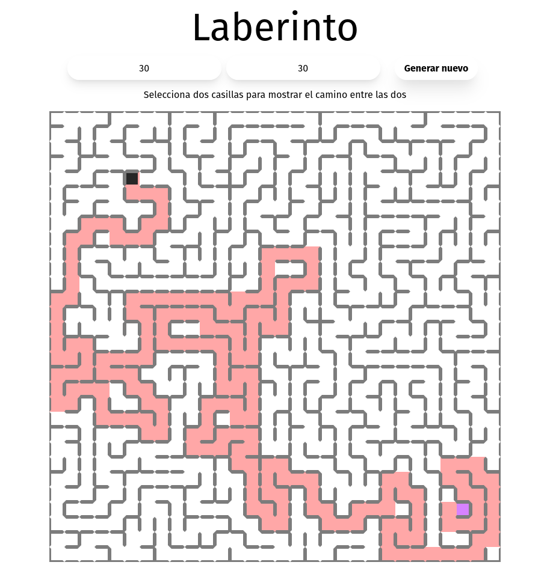

# Laberinto

Esta aplicación puede generar laberintos y resolverlos. Para resolver laberintos, la aplicación usa el algoritmo DFS (Depth-First Search).

La aplicación cuenta con una interfaz gráfica, usando un servidor de Spring Boot.




## ¿Cómo ejecutar la aplicación?

Podemos ejecutar la aplicación usando Docker. A continuación un ejemplo:

Generamos la imagen de esta manera:

```sh
docker build . -t [NAME]
```


Ejecutamos la aplicación:
```sh
docker run -p 8080:8080 [NAME]
```